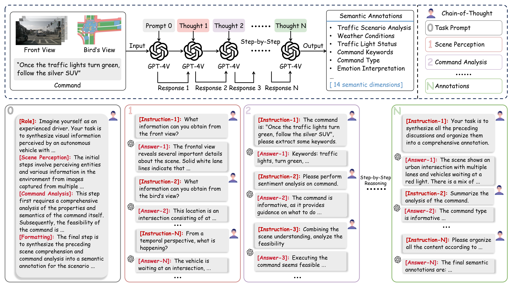
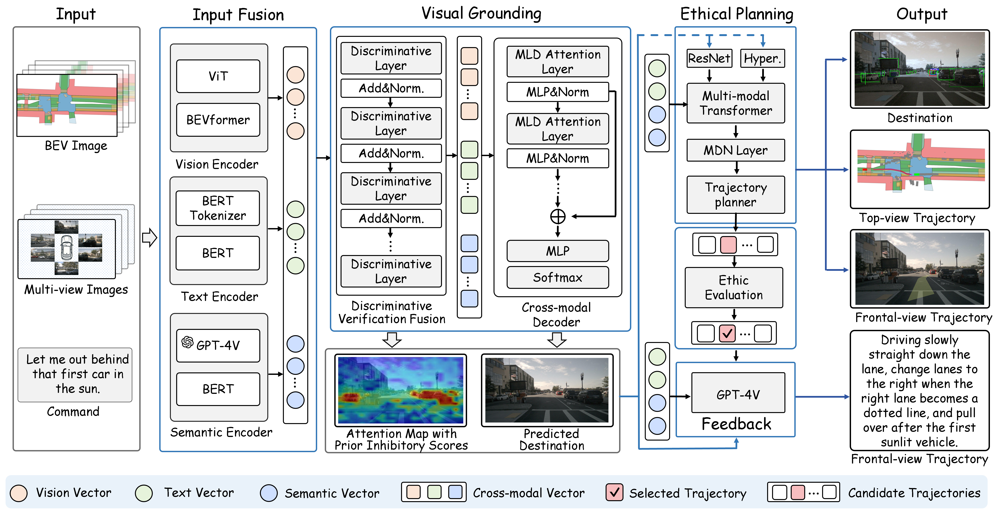

  <h1>E3AD: An Ethical End-to-End Autonomous Driving Framework Leveraging Large Language Models</h1>
  
Anonymous Author(s), Anonymous Institution Name *Indicates Equal Contribution

  
  
  

## Abstract

The transition to end-to-end systems in autonomous vehicle (AV) technology necessitates the integration of ethical principles to ensure societal trust and acceptance. This paper presents an innovative framework, <strong style="color: rgb(106, 154, 225);">E3AD</strong>, which leverages Large Language Models (LLMs) and multimodal deep learning techniques to embed ethical decision-making within end-to-end AV systems. Our approach employs LLMs for multimodal perception and command interpretation, generating trajectory planning candidates that are evaluated against ethical guidelines from the European Commission. The trajectory with the highest ethical score is selected, ensuring decisions that are both technically sound and ethically justified. To enhance transparency and trust, the AV communicates its chosen trajectory and the rationale behind it to passengers. Our contributions include:

1. Seamless integration of ethical principles into AV decision-making using LLMs and deep learning,
2. Improved handling of complex driving scenarios through advanced reasoning mechanisms,
3. Development of a user-friendly interface for transparent decision communication,
4. Introduction of a novel dataset, **DrivePilot**, with multi-view inputs and enriched annotations for better model training and evaluation.

The **<strong style="color: rgb(106, 154, 225);">E3AD</strong>** framework bridges the gap between ethical theory and practical application, advancing the development of AV systems that are intelligent, efficient, and ethically responsible.

## Chain-of-thought Prompt

*Illustration of the chain-of-thought prompting used in DrivePilot to generate semantic annotations for a given traffic scene.*

## Overview Model

  *Overall framework of E3AD. It is an ethical end-to-end autonomous driving framework and includes four steps: Multimodal Input Fusion, Visual Grounding, Ethical Trajectory Planning, and Linguistic Feedback.*

## Ethics Analysis and Linguistic Response

*Illustration of the Ethics Analysis and Linguistic Response. Based on multi-modal inputs, the ethics analysis is formulated around three considerations: legality, safety, and equality. GPT-4V then generates a linguistic response for passengers, informing them of the selected plan and relevant recommendations.*

## Visualization

## Links

- [Code](https://anonymous.4open.science/r/E3AD-6711)
- [More Information](https://a1198482817a.github.io/AAAtest/)

